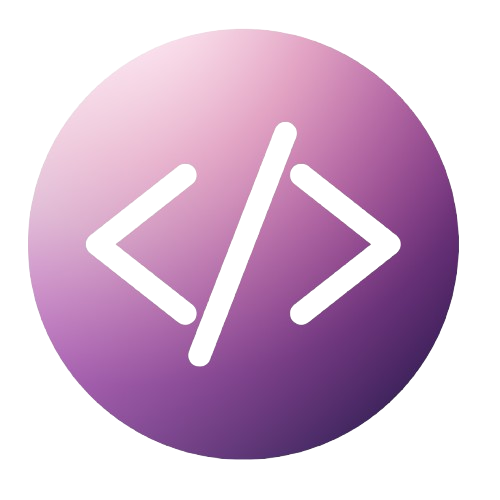

 

  

<picture> </picture>
 
-  🙋🏾‍♀️ Me chamo Rayssa e tenho 26 anos
- 🎓 Sou estudante de Tecnologia da Informação na UNIVESP
- 💻 Desenvolvendo habilidades em Desenvolvimento Full Stack
- 📲 Vamos nos conectar? Me encontre no [`LinkedIn`](https://www.linkedin.com/in/rayssantana/).
- ✉️ Precisa falar comigo? Envie um [email](mailto:rayssasantana.br@gmail.com), ficarei feliz em responder!

 

  
 
 

  
   
  

 

<h3 align="center">  
   Studying in this moment:
</h3> 

  

 

<h3 align="center" > Contact me 💜 </h3>

 

 
 

